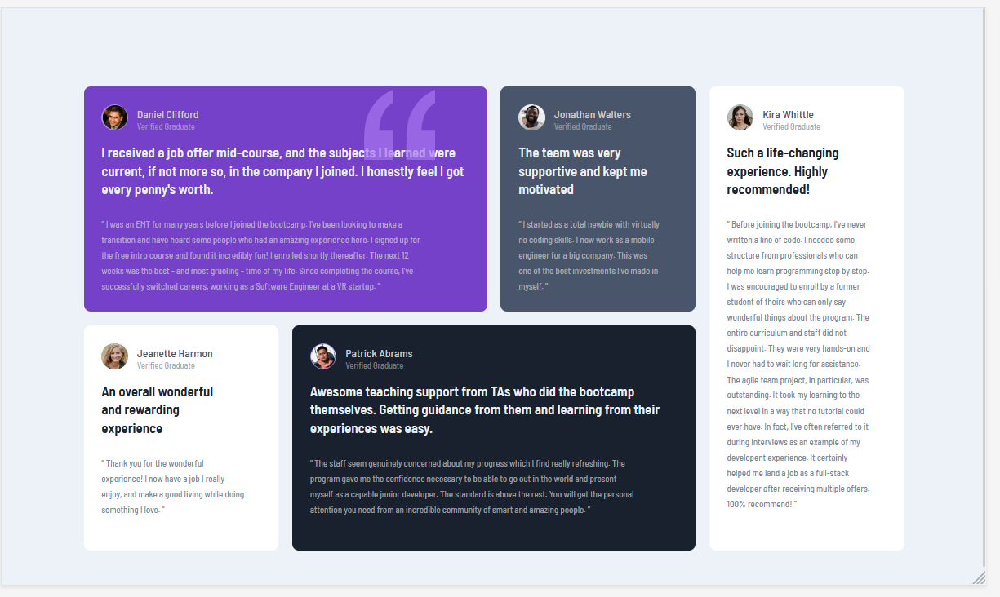

# Frontend Mentor - Testimonials grid section solution

This is a solution to the [Testimonials grid section challenge on Frontend Mentor](https://www.frontendmentor.io/challenges/testimonials-grid-section-Nnw6J7Un7). Frontend Mentor challenges help you improve your coding skills by building realistic projects. 

## Table of contents

- [Overview](#overview)
  - [The challenge](#the-challenge)
  - [Screenshot](#screenshot)
  - [Links](#links)
- [My process](#my-process)
  - [Built with](#built-with)
  - [What I learned](#what-i-learned)
  - [Continued development](#continued-development)
  - [Useful resources](#useful-resources)
- [Author](#author)
- [Acknowledgments](#acknowledgments)

## Overview
### The challenge

Users should be able to:

- View the optimal layout for the site depending on their device's screen size

### Screenshot

### 
Desktop view
 

### 
Mobile View
 

# 
### Links

- Solution URL : [Git URL](https://github.com/mathangisd/testimonials-grid-section.git)

- Live URL : [Huddle Landing Page on Netlify](https://testimonials-grid-section-msd.netlify.app/)

## My process
### Built with

- Semantic HTML5 markup
- CSS custom properties
- CSS Grid
- CSS Flexbox
- CSS pseudo-elements

### What I learned

I was able to practice grid properties and learned how to style blockquotes.

### Continued-Development
I would like to build more projects using CSS grid and make them responsive.

## Useful resources
- [Quotes with Font Awesome and pseudo elements](https://codepen.io/jimmycow/pen/LmjVaz) - Jaime

- [Overflow Issues In CSS](https://www.smashingmagazine.com/2021/04/css-overflow-issues/) - Ahmad Shadeed

## Author
- Website - [Mathangi Subramanian](https://github.com/mathangisd)
- Frontend Mentor - [mathangisd](https://www.frontendmentor.io/profile/mathangisd)

## Acknowledgments
Thank you to anyone for giving any feedback, it is always helpful to know how the code could be improved.
